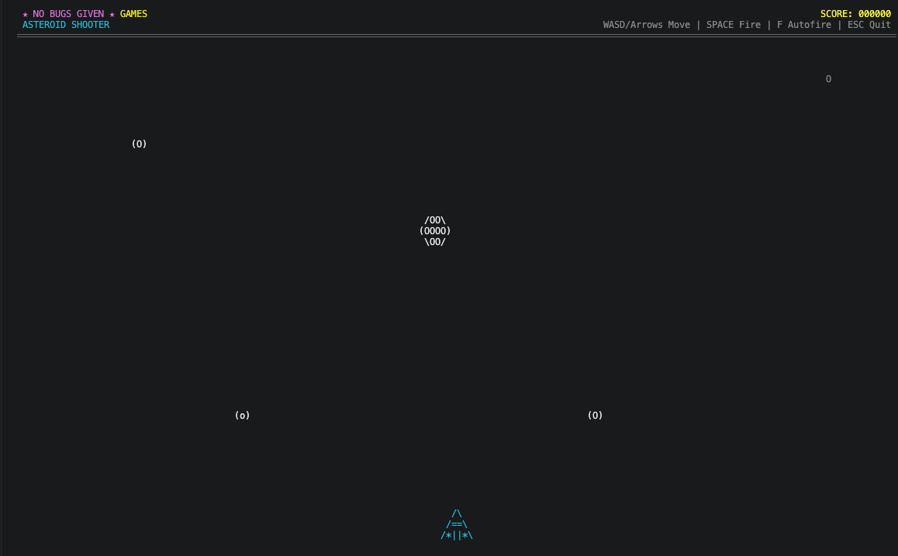

# 🚀 Asteroid Shooter (Console Edition)

A fast-paced, retro-style asteroid shooter that runs right in your terminal. Built with .NET and rendered entirely with ASCII art — no GUI required.



---

## 🎮 How to Play

### Download from Releases

Pre-built single-file executables are available on the [Releases](https://github.com/nobugsgiven/shooter-astroid.cli.games.nobugsgiven.com-Private/releases) page. No runtime or installation needed — just download and run.

| Platform | Download | Run |
|----------|----------|-----|
| **Windows x64** | `ShooterAstroidConsole-win-x64.zip` | Extract and double-click `ShooterAstroidConsole.exe` |
| **macOS Intel** | `ShooterAstroidConsole-osx-x64.tar.gz` | `tar -xzf` then `./ShooterAstroidConsole` |
| **macOS Apple Silicon** | `ShooterAstroidConsole-osx-arm64.tar.gz` | `tar -xzf` then `./ShooterAstroidConsole` |
| **Linux x64** | `ShooterAstroidConsole-linux-x64.tar.gz` | `tar -xzf` then `./ShooterAstroidConsole` |

> **Note:** macOS and Linux users may need to mark the binary as executable first:  
> `chmod +x ShooterAstroidConsole`

### Controls

| Key | Action |
|-----|--------|
| `←` `→` or `A` `D` | Move left / right |
| `↑` `↓` or `W` `S` | Move up / down |
| `Spacebar` | Fire laser |
| `F` | Toggle auto-fire |
| `Escape` | Quit |

- **Momentum-based movement** — your ship glides with physics; it doesn't stop instantly when you release a key. Use this to curve around asteroids smoothly.
- **Survive as long as you can** — asteroids spawn faster over time.
- **High score** — your score and kill count are shown in the header.

---

## 🛠️ Development Setup

### Prerequisites

- [.NET 10 SDK](https://dotnet.microsoft.com/download)
- A terminal that supports Unicode and cursor hiding ( virtually all modern terminals do )
- Git

### Clone & Build

```bash
# Clone the repository
git clone git@github.com-nobugsgiven:nobugsgiven/shooter-astroid.cli.games.nobugsgiven.com-Private.git
cd shooter-astroid.cli.games.nobugsgiven.com-Private

# Build
dotnet build

# Run
dotnet run
```

### Useful Dev Commands

```bash
# Run with debug probe (prints console dimensions)
dotnet run -- --probe

# Run self-tests (headless, no UI required)
dotnet run -- --selftest

# Publish a single-file release locally
dotnet publish -c Release -r osx-arm64 --self-contained true \
  -p:PublishSingleFile=true -p:PublishTrimmed=true \
  -p:TrimMode=partial -o ./publish

# Run the published binary directly
./publish/ShooterAstroidConsole
```

### Project Structure

| File | Purpose |
|------|---------|
| `Game.cs` | Main game loop, state management, collision detection |
| `Player.cs` | Ship physics, momentum-based movement, sprite |
| `ConsoleRenderer.cs` | Terminal drawing, screen layout, animations |
| `InputManager.cs` | Non-blocking keyboard input with smart key-repeat handling |
| `Asteroid.cs` | Asteroid entities with randomized shapes and rotation |
| `Laser.cs` | Projectile physics and lifetime management |
| `Explosion.cs` | Death animations and particle effects |
| `Layout.cs` | Screen layout constants and bounds |
| `Program.cs` | Entry point, argument parsing (`--probe`, `--selftest`) |
| `SelfTest.cs` | Automated headless tests for input, physics, and collision logic |

### Architecture Highlights

- **60 FPS fixed timestep** with frame-rate capping to keep CPU usage low.
- **Momentum physics** — acceleration, friction, and velocity are applied every frame for smooth, natural movement.
- **Smart input handling** — bridges OS key-repeat delays so the ship moves instantly on the first press without stuttering.
- **Collision detection** — AABB (axis-aligned bounding box) checks between lasers, asteroids, and the player.
- **Terminal-safe rendering** — gracefully degrades on legacy terminals that don't support cursor hiding or Unicode.

---

## 📦 Creating a Release

Push a version tag and GitHub Actions will build and publish binaries for all platforms automatically:

```bash
git tag v1.0.0
git push origin v1.0.0
```

The [release workflow](.github/workflows/release.yml) compiles trimmed, single-file, self-contained executables for Windows, macOS (Intel & Apple Silicon), and Linux, then attaches them to a new GitHub Release with auto-generated notes.

---

## 📝 License

Private — all rights reserved by [NoBugs Given](https://github.com/nobugsgiven).
